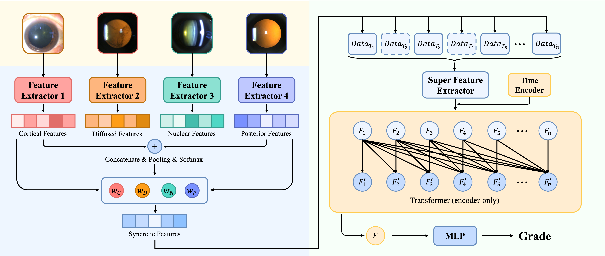

# 🧠 LiveModel

<div style="text-align:center;">
    
</div>

**LiveModel** is a spatiotemporal multimodal AI framework designed for **early detection, functional assessment, and progression forecasting** of age-related cataract using **multi-angle slit-lamp images** and longitudinal follow-up sequences.

---

# ⚠️ Code Release Scope

This repository **releases only the code for**:

- 📦 Data processing utilities (dataset & dataloading interfaces)
- 🏗️ Model architectures
- 🎯 Trainers
- 🚀 Training entrypoints (`*_main.py`)
- 📈 Prediction export and statistical analysis

This repository **does NOT include**:

- 🔒 Clinical dataset / labels
- 🔒 Pretrained model weights / checkpoints
- 🔒 Clinical test cases / demo samples

---

# 📂 Repository Structure

```text
.
├── .gitignore
├── LICENSE
├── LiveModel.png
├── README.md
├── data/
│   ├── label/.gitkeep      # Place your labels here
│   └── photo/.gitkeep      # Place your images here
├── dataset/
│   ├── DataSet.py
│   ├── DataStructure.py
│   ├── __init__.py
│   └── util.py
├── model/
│   ├── SnapRegressor.py
│   ├── ViewFusionRegressor.py
│   ├── SingleViewTimeFusionRegressor.py
│   ├── MultiViewTimeFusionRegressor.py
│   ├── __init__.py
│   ├── transformers.py
│   └── util.py
├── trainer/
│   ├── BaseTrainer.py
│   ├── SnapRegressorTrainer.py
│   ├── ViewFusionRegressorTrainer.py
│   ├── SingleViewTimeFusionRegressorTrainer.py
│   ├── MultiViewTimeFusionRegressorTrainer.py
│   ├── __init__.py
│   └── util.py
├── main/
│   ├── SnapRegressor_main.py
│   ├── ViewFusionRegressor_main.py
│   ├── SingleViewTimeFusionRegressor_main.py
│   ├── MultiViewTimeFusionRegressor_main.py
│   └── util.py
├── training/
│   ├── train_SnapRegressor.sh
│   ├── train_ViewFusionRegressor.sh
│   ├── train_SingleViewTimeFusionRegressor.sh
│   └── train_MultiViewTimeFusionRegressor.sh
├── evaluation/
│   ├── evaluation_dataset.py
│   ├── evaluation_util.py
│   ├── export_predictions.py
│   ├── export_predictions.sh
│   ├── export_main.py
│   ├── analysis_core.py
│   ├── analysis_tests.py
│   ├── analysis_tasks.py
│   ├── analysis_human.py
│   ├── analyze_main.py
│   ├── analyze_predictions.sh
│   ├── analyze_reliability.py
│   └── reliability/
│       ├── __init__.py
│       ├── intra_rater.py
│       ├── reader_icc.py
│       └── wide_repeatability.py
├── tests/
│   └── test_training_and_analysis.py
└── requirements.txt
```

## 📁 Directory Description

| Folder | Description |
|--------|-------------|
| 📁 `data/` | Images and labels |
| 📚 `dataset/` | Dataset definitions and dataloading utilities |
| 🧠 `model/` | Neural network architectures |
| 🎯 `trainer/` | Training pipelines |
| 🚀 `main/` | Training entrypoints |
| ⚙️ `training/` | Shell scripts for training |
| 📈 `evaluation/` | Evaluation, prediction export, and analysis tools |
| 🧪 `tests/` | Code-level checks |

---

# 🛠️ Environment & Dependencies

## 📌 Core Framework Versions

```text
torch==2.7.1
torchvision==0.22.1
```

## 📦 Expected Dependencies

```text
torch
torchvision
numpy
pandas
scikit-learn
statsmodels
Pillow
opencv-python
```

---

# ⚙️ Installation

```bash
pip install -r requirements.txt
```

---

# 🧠 Model Overview

## 1️⃣ SnapRegressor

📷 Single-view cataract assessment using an EfficientNet-B0 backbone with LOCS III regression.

---

## 2️⃣ ViewFusionRegressor

🔍 Processes four slit-lamp views and fuses complementary spatial information through cross-attention to predict LOCS III and LensVision metrics.

---

## 3️⃣ SingleViewTimeFusionRegressor

⏳ Extends the single-view model with a Transformer-based temporal encoder to capture longitudinal changes and forecast 2-year cataract progression.

---

## 4️⃣ MultiViewTimeFusionRegressor

🌐 Combines multi-view spatial fusion and temporal sequence modeling, leveraging cross-attention and Transformer-based temporal encoding to predict current severity and forecast 2-year progression.

---

# 📋 Data Preparation

⚠️ Dataset is **NOT provided**.

Expected input:

- 📷 4 slit-lamp views per visit
- 📅 Longitudinal visit sequences

Place your data under:

```text
data/photo/
data/label/
```

---

# 🚀 Training

This repository provides training entrypoints under `main/`:

- 🚀 `main/SnapRegressor_main.py`
- 🚀 `main/ViewFusionRegressor_main.py`
- 🚀 `main/SingleViewTimeFusionRegressor_main.py`
- 🚀 `main/MultiViewTimeFusionRegressor_main.py`

Each entrypoint is designed to be launched by users according to their hardware setting.

Example: GPU usage

```bash
python main/SnapRegressor_main.py --your_args_here
```

> 💡 Because datasets and weights are not released, users must configure their own training settings, including batch size, `num_workers`, mixed precision, checkpoint paths, and other hardware-dependent options.
>
> 📝 The training scripts specify the model settings for each stage.

---

# 🔬 Reproducibility Notes

- 🖼️ Image input resolution and augmentation policy in the paper included resizing to **224×224** and common photometric/geometric augmentations.
- ⚡ Training uses **AdamW** with linear learning-rate warm-up followed by cosine annealing with warm restarts.
- 🔄 Progressive initialization was applied from single-view modeling to spatial fusion and then spatiotemporal modeling:

```text
SnapRegressor
    ↓
ViewFusionRegressor
    ↓
SingleViewTimeFusionRegressor
    ↓
MultiViewTimeFusionRegressor
```

---

# 📊 Data Availability

🔒 All de-identified participant data and annotations are under restricted access to protect privacy and comply with ethics regulations.

Access requests require institutional review and approval.

---

# 📜 License

📄 This project is licensed under the **Apache License 2.0**.

---

# ⚠️ Disclaimer

🩺 For research use only.

❌ Not intended for clinical diagnosis or medical decision making.

---

# 📧 Contact

For questions regarding the manuscript or data access requests, please contact the corresponding author.
